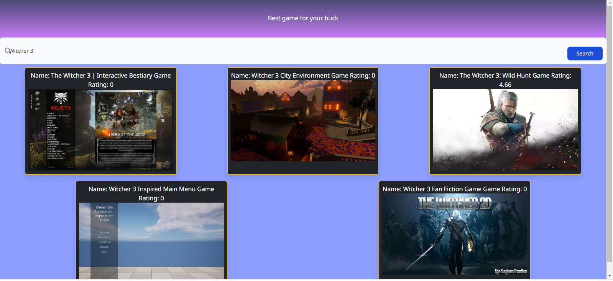

# The-best-game-for-your-buck

## Description

The Best Game For Your Buck aims to provide users with an easy to navigate source for their gaming collections. Users are able to search their favourite games and find the best deals on the market. Using the rawg api, users can search for a game they are interested in and then with the help of cheapshark api they can see the best deals for their selection. 

Through creating this web application we as a team learned about the integration of several API's functioning together and the troubleshooting methods we needed. We created a well planned project from the beginning and were able to delegate our tastks appropriately and efficiently. 

As a future project we are aiming to deploy a multi layered search bar that will show users a selection of games from multiple search criteria of their choosing.

## Table of Contents (Optional)

If your README is long, add a table of contents to make it easy for users to find what they need.

- [Installation](#installation)
- [Usage](#usage)
- [Credits](#credits)
- [License](#license)

## Installation

No need to install, simply open webpage and use the search bar to find a game you are interested in.

## Usage

Once the webpage is open, the user can enter the term they are searching for. The more accurate the name, the more refined their results will be. Once a game is selected, they are redirected to the second page where information on the game's current on sale price as well as the location of the sale is displayed.

.
    
    

## Credits

Repository owned by Mitsushiro Hirano, 
Project collaborators include Tamas Pinter: https://github.com/TamasPinter and Lee Zhang: https://github.com/Liguang-Lee-Zhang

API credit to 
Cheapshark- https://www.cheapshark.com/api/1.0 
and 
Rawg- https://www.rawg.io/apidocs
## License

UI credits to 
Bootstrap- https://getbootstrap.com/
Tailwind CSS- https://tailwindcss.com/
Google Fonts- https://fonts.google.com/
Flowbite CSS- https://flowbite.com/

MIT License

Copyright (c) 2023 TamasPinter

Permission is hereby granted, free of charge, to any person obtaining a copy
of this software and associated documentation files (the "Software"), to deal
in the Software without restriction, including without limitation the rights
to use, copy, modify, merge, publish, distribute, sublicense, and/or sell
copies of the Software, and to permit persons to whom the Software is
furnished to do so, subject to the following conditions:

The above copyright notice and this permission notice shall be included in all
copies or substantial portions of the Software.

THE SOFTWARE IS PROVIDED "AS IS", WITHOUT WARRANTY OF ANY KIND, EXPRESS OR
IMPLIED, INCLUDING BUT NOT LIMITED TO THE WARRANTIES OF MERCHANTABILITY,
FITNESS FOR A PARTICULAR PURPOSE AND NONINFRINGEMENT. IN NO EVENT SHALL THE
AUTHORS OR COPYRIGHT HOLDERS BE LIABLE FOR ANY CLAIM, DAMAGES OR OTHER
LIABILITY, WHETHER IN AN ACTION OF CONTRACT, TORT OR OTHERWISE, ARISING FROM,
OUT OF OR IN CONNECTION WITH THE SOFTWARE OR THE USE OR OTHER DEALINGS IN THE
SOFTWARE.
